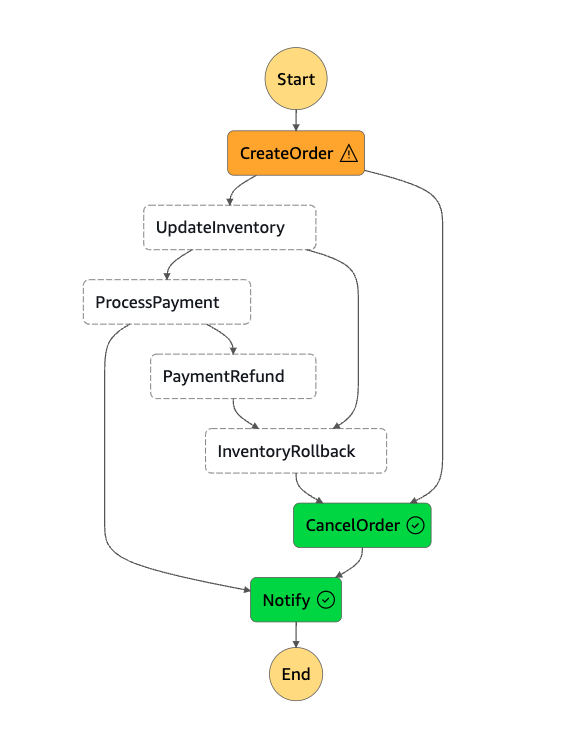
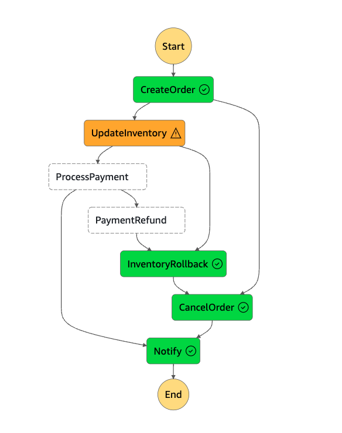
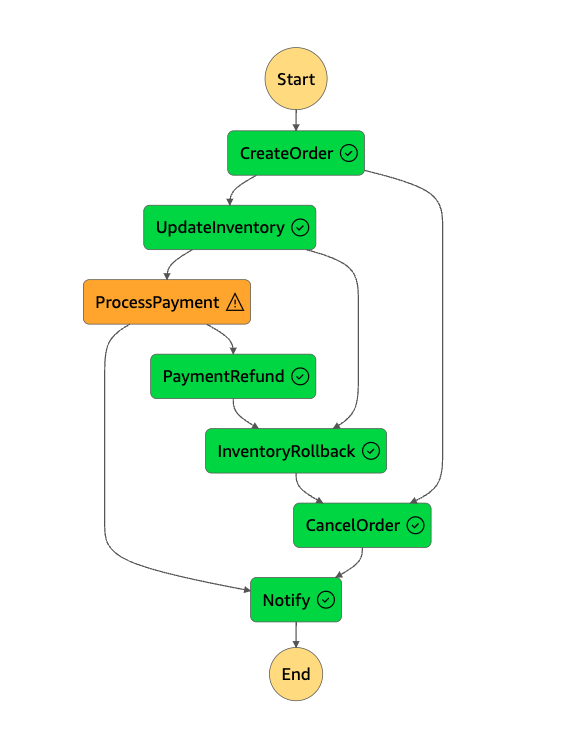

# Saga Pattern Implementation with AWS Step Functions

### Overview

This repository contains source code that shows how to Orchestrate Microservices using Saga Pattern with AWS Step Functions.

The blueprint provides a implementation of the SAGA pattern for an e-commerce application using AWS Step Functions.

<!-- [This blog post](https://docs.aws.amazon.com/lambda/) explains the sample in depth. -->

### Project structure

This project contains `infrastructure` folder which contains infrastructure code written with AWS SAM under `template.yml`, `lambdas` directory contains all AWS Lambda functions source code.

### Prerequisites

- AWS account with access to AWS Step Functions, Lambda, and other necessary services.
- Node.js for changing AWS Lambda functions' code
- AWS CLI installed and configured.
- SAM

### Setup

**Step 1:** Clone the Repository

```bash
git clone https://github.com/aliliarif/saga-step-functions
```

**Step 2:** Install Dependencies

```bash
cd saga-step-functions
npm install
```

**Step 3:** Deploy

```bash
cd infrastructure
sam build
sam deploy --guided --capabilities CAPABILITY_NAMED_IAM CAPABILITY_AUTO_EXPAND
```

### Payload to test the State Machine

**Sample JSON for Order process failure**

```json
{
  "body": "{\"failCreateOrder\": true}"
}
```



**Sample JSON for Inventory update failure**

```json
{
  "body": "{\"failInventoryUpdate\": true}"
}
```



**Sample JSON for Payment process failure**

```json
{
  "body": "{\"failProcessPayment\": true}"
}
```



### Cleanup

Clean up the resources deployed by SAM project

```bash
cd infrastructure
sam delete
```

### References

- [AWS Step Functions Documentation](https://docs.aws.amazon.com/step-functions/)
- [AWS Lambda Documentation](https://docs.aws.amazon.com/lambda/)
- [AWS SAM](https://docs.aws.amazon.com/serverless-application-model/latest/developerguide/serverless-getting-started.html)
